<div align="center">

<<<<<<< HEAD
# 🛡️ Code Guardian v1.15
=======
# 🛡️ Code Guardian
### *AI-Powered Enterprise Security Analysis Platform*
>>>>>>> 0fb2753d (Release v1.3.0)

<p align="center">
  
  
  
</p>

<p align="center">
  <strong>🚀 Revolutionary security analysis that understands your code like a senior engineer</strong><br/>
  <em>✨ Privacy-first • Real-time • Enterprise-grade • Zero-configuration</em>
</p>

<!-- Animated Banner -->
<div align="center">
  
</div>

<br/>

<!-- Interactive Demo Preview with Animation -->
<div align="center">
  <picture>
    <source media="(prefers-color-scheme: dark)" srcset="https://via.placeholder.com/800x400/1a1a1a/ffffff?text=🛡️+Code+Guardian+Dashboard+(Dark+Mode)">
    
  </picture>
  
  <!-- Floating Feature Cards -->
  <div style="position: relative; margin-top: -50px;">
    
    
    
  </div>
</div>

<!-- CSS Animation Styles -->
<style>
@keyframes float {
  0%, 100% { transform: translateY(0px); }
  50% { transform: translateY(-10px); }
}
</style>

<!-- Interactive Stats Counter -->
<div align="center">
  <table>
    <tr>
      <td align="center">
        
        <br/><sub><b>🛡️ Total Vulnerabilities Detected</b></sub>
      </td>
      <td align="center">
        
        <br/><sub><b>📁 Files Analyzed</b></sub>
      </td>
      <td align="center">
        
        <br/><sub><b>🧠 AI Insights Generated</b></sub>
      </td>
    </tr>
  </table>
</div>

</div>

---

## 🎯 **What is Code Guardian?**

Code Guardian revolutionizes how developers approach security by combining **cutting-edge AI** with **enterprise-grade analysis**. Unlike traditional scanners that rely on outdated rule sets, our platform leverages multiple AI providers to provide intelligent, context-aware security analysis.

<div align="center">

### 🌟 **Why Developers Choose Code Guardian**

| 🔒 **Privacy-First** | 🧠 **AI-Powered** | ⚡ **Real-Time** | 🛡️ **Enterprise** |
|:---:|:---:|:---:|:---:|
| 100% Local Processing | GPT-4 & Claude 3.5 | Lightning Fast | Military-Grade Security |
| Your Code Never Leaves | Context-Aware Analysis | Live Monitoring | OWASP Compliant |
| Zero Data Collection | Intelligent Suggestions | Instant Feedback | Zero-Trust Architecture |

</div>

---

## ✨ **Core Features**

<details>
<summary>🔍 <strong>Advanced Security Analysis</strong></summary>

- **🛡️ OWASP Top 10 Detection** - Complete coverage of OWASP 2021 categories
- **🔐 CVE Database Integration** - Real-time vulnerability database matching
- **💉 SQL Injection Prevention** - Advanced pattern recognition
- **🌐 XSS Protection** - Cross-site scripting vulnerability detection
- **🔑 Authentication Analysis** - Secure authentication pattern validation
- **📊 Security Scoring** - Comprehensive security metrics and scoring

</details>

<details>
<summary>🧠 <strong>AI-Powered Intelligence</strong></summary>

- **🤖 Multi-AI Support** - GPT-4, Claude 3.5, Gemini, Mistral, and more
- **💡 Smart Recommendations** - Context-aware fix suggestions
- **🔧 Auto-Fix Generation** - AI-generated security patches
- **📝 Natural Language Descriptions** - Human-readable vulnerability explanations
- **🎯 Context Understanding** - Deep code comprehension and analysis

</details>

<details>
<summary>⚡ <strong>Performance & Real-Time</strong></summary>

- **🚀 Lightning Fast Scanning** - Optimized for speed and efficiency
- **📊 Real-Time Monitoring** - Live analysis and feedback
- **🔄 Progressive Results** - Streaming analysis results
- **📈 Performance Metrics** - Detailed performance insights
- **⚙️ Resource Optimization** - Minimal system resource usage

</details>

<details>
<summary>🎨 <strong>Modern User Experience</strong></summary>

- **🌙 Dark/Light Mode** - Adaptive theme support
- **📱 Responsive Design** - Works on all devices
- **🎭 Glass Morphism UI** - Modern, elegant interface
- **♿ Accessibility** - WCAG 2.1 compliant
- **🎬 Smooth Animations** - Delightful user interactions

</details>

---

## 🚀 **Quick Start**

<div align="center">

### 🎯 **Choose Your Installation Method**

</div>

<details>
<summary>🐳 <strong>Docker Installation (Recommended)</strong></summary>

```bash
# Pull and run with Docker
docker run -p 5173:5173 codeguardian/code-guardian:latest

# Or with Docker Compose
curl -O https://raw.githubusercontent.com/your-username/code-guardian/main/docker-compose.yml
docker-compose up -d
```

**Benefits:**
- ✅ Zero configuration required
- ✅ Isolated environment
- ✅ Consistent across platforms
- ✅ Automatic updates

</details>

<details>
<summary>📦 <strong>NPM Installation</strong></summary>

### 🔧 **Prerequisites**

```bash
# Node.js 18+ required
node --version  # Should be 18.0.0 or higher
npm --version   # Should be 8.0.0 or higher
```

### ⚡ **Installation Steps**

```bash
# 1. Clone the repository
git clone https://github.com/your-username/code-guardian.git
cd code-guardian

# 2. Install dependencies
npm install

# 3. Configure environment (optional)
cp .env.example .env
# Edit .env with your AI API keys

# 4. Start development server
npm run dev
```

### 🌐 **Access Points**

```bash
# Local development
🌐 http://localhost:5173

# Production build
npm run build && npm run preview
🚀 http://localhost:4173
```

</details>

<details>
<summary>☁️ <strong>Cloud Deployment</strong></summary>

### 🚀 **One-Click Deployments**

[](https://vercel.com/new/clone?repository-url=https://github.com/your-username/code-guardian)
[](https://app.netlify.com/start/deploy?repository=https://github.com/your-username/code-guardian)
[](https://railway.app/new/template/code-guardian)

### ⚙️ **Manual Cloud Setup**

```bash
# Vercel CLI
npm i -g vercel
vercel --prod

# Netlify CLI
npm i -g netlify-cli
netlify deploy --prod

# Railway CLI
npm i -g @railway/cli
railway deploy
```

</details>

<details>
<summary>🏠 <strong>Local AI Setup (Privacy Mode)</strong></summary>

### 🤖 **Ollama Setup**

```bash
# Install Ollama
curl -fsSL https://ollama.ai/install.sh | sh

# Pull recommended models
ollama pull codellama:13b
ollama pull mistral:7b
ollama pull llama2:13b

# Start Ollama server
ollama serve
```

### 🖥️ **LM Studio Setup**

1. Download [LM Studio](https://lmstudio.ai/)
2. Install and launch the application
3. Download recommended models:
   - `CodeLlama-13B-Instruct`
   - `Mistral-7B-Instruct`
   - `WizardCoder-15B`
4. Start local server on port 1234

### ⚡ **Performance Optimization**

```bash
# For better performance, allocate more memory
export NODE_OPTIONS="--max-old-space-size=8192"

# Enable GPU acceleration (if available)
export OLLAMA_GPU=1
```

</details>

---

## 📊 **Comprehensive Usage Guide**

### 🎯 **Getting Started - Step by Step**

<div align="center">


</div>

### 🚀 **Interactive Analysis Workflow**

<details>
<summary>📁 <strong>File Upload & Management</strong></summary>

#### **Supported File Types**
```typescript
const supportedExtensions = {
  // Web Technologies
  web: ['.js', '.jsx', '.ts', '.tsx', '.vue', '.svelte'],
  
  // Backend Languages
  backend: ['.py', '.java', '.cs', '.php', '.rb', '.go', '.rs'],
  
  // Mobile Development
  mobile: ['.swift', '.kt', '.dart', '.m', '.mm'],
  
  // Configuration & Infrastructure
  config: ['.json', '.yaml', '.yml', '.xml', '.toml', '.ini'],
  
  // Database & Query
  database: ['.sql', '.graphql', '.prisma'],
  
  // Documentation
  docs: ['.md', '.mdx', '.rst', '.txt']
};
```

#### **Upload Methods**
- 🖱️ **Drag & Drop** - Simply drag files into the upload zone
- 📂 **File Browser** - Click to select files from your system
- 📋 **Paste Code** - Directly paste code snippets for quick analysis
- 🔗 **GitHub Integration** - Connect and analyze repositories directly
- 📦 **ZIP Upload** - Upload entire project archives

#### **File Processing Pipeline**
1. **📊 File Validation** - Check file size, type, and encoding
2. **🔍 Content Analysis** - Extract metadata and structure
3. **🏷️ Language Detection** - Identify programming languages
4. **📋 Framework Detection** - Recognize frameworks and libraries
5. **⚡ Preprocessing** - Optimize for analysis performance

</details>

<details>
<summary>🤖 <strong>AI Provider Configuration</strong></summary>

#### **🔑 API Key Management**

```bash
# Environment Configuration
cp .env.example .env

# OpenAI Configuration
VITE_OPENAI_API_KEY=sk-your-openai-key
VITE_OPENAI_MODEL=gpt-4-turbo-preview
VITE_OPENAI_MAX_TOKENS=4096

# Anthropic Configuration
VITE_ANTHROPIC_API_KEY=sk-ant-your-claude-key
VITE_ANTHROPIC_MODEL=claude-3-5-sonnet-20241022
VITE_ANTHROPIC_MAX_TOKENS=4096

# Google AI Configuration
VITE_GOOGLE_API_KEY=your-gemini-key
VITE_GOOGLE_MODEL=gemini-1.5-pro

# Local AI Configuration
VITE_OLLAMA_BASE_URL=http://localhost:11434
VITE_LM_STUDIO_BASE_URL=http://localhost:1234
```

#### **🎛️ Analysis Configuration**

```typescript
interface AnalysisConfig {
  // AI Provider Settings
  provider: 'openai' | 'anthropic' | 'google' | 'ollama' | 'lmstudio';
  model: string;
  temperature: number; // 0.0 - 1.0
  maxTokens: number;
  
  // Security Analysis
  security: {
    owaspEnabled: boolean;
    cveCheckEnabled: boolean;
    customRulesEnabled: boolean;
    severityThreshold: 'low' | 'medium' | 'high' | 'critical';
  };
  
  // Performance Settings
  performance: {
    parallelAnalysis: boolean;
    maxConcurrentRequests: number;
    timeoutDuration: number;
    cacheResults: boolean;
  };
  
  // Output Preferences
  output: {
    includeFixSuggestions: boolean;
    generateDocumentation: boolean;
    exportFormat: 'json' | 'csv' | 'pdf' | 'html';
    detailLevel: 'summary' | 'detailed' | 'comprehensive';
  };
}
```

#### **🏠 Local AI Setup Guide**

**Ollama Installation & Configuration:**
```bash
# Install Ollama
curl -fsSL https://ollama.ai/install.sh | sh

# Download recommended models
ollama pull codellama:13b-instruct    # Code analysis
ollama pull mistral:7b-instruct       # General purpose
ollama pull llama2:13b-chat          # Conversational
ollama pull wizardcoder:15b           # Advanced coding

# Configure Ollama for Code Guardian
export OLLAMA_HOST=0.0.0.0:11434
export OLLAMA_MODELS=/usr/share/ollama/.ollama/models
ollama serve
```

**LM Studio Configuration:**
```bash
# Download LM Studio from https://lmstudio.ai/
# Recommended models for security analysis:
# - CodeLlama-13B-Instruct-GGUF
# - Mistral-7B-Instruct-v0.2-GGUF
# - WizardCoder-Python-13B-V1.0-GGUF

# Start local server
# LM Studio -> Local Server -> Start Server
# Default: http://localhost:1234/v1
```

</details>

<details>
<summary>🛡️ <strong>Security Analysis Configuration</strong></summary>

#### **🎯 OWASP Top 10 Coverage**

```typescript
const owaspCategories = {
  A01: {
    name: "Broken Access Control",
    patterns: ["unauthorized access", "privilege escalation", "CORS misconfiguration"],
    severity: "high",
    cweMapping: ["CWE-22", "CWE-352", "CWE-425"]
  },
  A02: {
    name: "Cryptographic Failures",
    patterns: ["weak encryption", "hardcoded secrets", "insecure random"],
    severity: "high",
    cweMapping: ["CWE-327", "CWE-328", "CWE-330"]
  },
  A03: {
    name: "Injection",
    patterns: ["SQL injection", "NoSQL injection", "command injection"],
    severity: "critical",
    cweMapping: ["CWE-89", "CWE-78", "CWE-943"]
  }
  // ... additional categories
};
```

#### **🔍 Custom Security Rules**

```typescript
interface CustomSecurityRule {
  id: string;
  name: string;
  description: string;
  pattern: RegExp | string;
  severity: 'info' | 'low' | 'medium' | 'high' | 'critical';
  category: string;
  remediation: string;
  references: string[];
  
  // Advanced matching
  conditions: {
    fileTypes: string[];
    frameworks: string[];
    languages: string[];
    excludePaths: string[];
  };
}

// Example custom rule
const customRule: CustomSecurityRule = {
  id: "custom-001",
  name: "Hardcoded API Keys",
  description: "Detects potential API keys in source code",
  pattern: /(?:api[_-]?key|secret[_-]?key|access[_-]?token)\s*[:=]\s*['"][a-zA-Z0-9]{20,}['"]/gi,
  severity: "high",
  category: "Secrets Management",
  remediation: "Move API keys to environment variables or secure key management",
  references: ["https://owasp.org/www-project-top-ten/2017/A3_2017-Sensitive_Data_Exposure"],
  conditions: {
    fileTypes: [".js", ".ts", ".py", ".java"],
    frameworks: ["*"],
    languages: ["javascript", "typescript", "python", "java"],
    excludePaths: ["test/", "spec/", ".env.example"]
  }
};
```

</details>

<details>
<summary>📊 <strong>Results Dashboard & Analytics</strong></summary>

#### **🎨 Interactive Dashboard Features**

```mermaid
graph LR
    subgraph "Dashboard Components"
        A[📊 Security Score Widget]
        B[🎯 Vulnerability Heatmap]
        C[📈 Trend Charts]
        D[🔍 Issue Explorer]
        E[📋 Executive Summary]
    end
    
    subgraph "User Interactions"
        F[👆 Click Events]
        G[🔍 Hover Details]
        H[📱 Touch Gestures]
        I[⌨️ Keyboard Navigation]
    end
    
    subgraph "Real-time Updates"
        J[⚡ Live Data Stream]
        K[🔄 Auto Refresh]
        L[📡 WebSocket Connection]
    end
    
    A --> F
    B --> G
    C --> H
    D --> I
    E --> F
    
    J --> A
    K --> B
    L --> C
    
    style A fill:#e8f5e8
    style B fill:#fff3e0
    style C fill:#e3f2fd
    style D fill:#f3e5f5
    style E fill:#fce4ec
```



**Interactive Features:**
- **📈 Real-time Metrics** - Live security score updates with smooth animations
- **🔍 Drill-down Analysis** - Click any metric for detailed view with slide transitions
- **📊 Trend Visualization** - Historical analysis comparison with interactive charts
- **🎯 Risk Heatmap** - Visual representation of vulnerability distribution with hover effects
- **📋 Executive Summary** - High-level overview for stakeholders with expandable sections

#### **📊 Available Visualizations**

```typescript
interface DashboardWidgets {
  // Security Metrics
  securityScore: {
    current: number;
    trend: 'up' | 'down' | 'stable';
    history: number[];
  };
  
  // Vulnerability Distribution
  vulnerabilities: {
    critical: number;
    high: number;
    medium: number;
    low: number;
    info: number;
  };
  
  // Code Quality Metrics
  quality: {
    maintainabilityIndex: number;
    cyclomaticComplexity: number;
    technicalDebt: string;
    testCoverage: number;
  };
  
  // Performance Indicators
  performance: {
    analysisTime: number;
    filesProcessed: number;
    linesOfCode: number;
    issuesFound: number;
  };
}
```

#### **📤 Export & Reporting Options**

- **📄 PDF Reports** - Professional security assessment reports
- **📊 Excel Dashboards** - Detailed spreadsheets with charts
- **📋 JSON Data** - Raw data for integration with other tools
- **📈 HTML Reports** - Interactive web-based reports
- **📧 Email Summaries** - Automated report delivery

</details>

---

## 🏗️ **Technical Architecture**

<div align="center">

### 🔄 **Analysis Pipeline**

```mermaid
graph TD
    A[📁 File Upload] --> B[🔍 Language Detection]
    B --> C[📋 Framework Detection]
    C --> D[🧠 AI Analysis Engine]
    D --> E[🛡️ Security Scanner]
    E --> F[📊 Vulnerability Assessment]
    F --> G[🎯 Risk Scoring]
    G --> H[📈 Results Dashboard]
    H --> I[📤 Export & Reporting]
    
    D --> J[🤖 GPT-4]
    D --> K[🤖 Claude 3.5]
    D --> L[🤖 Gemini]
    D --> M[🏠 Local Models]
    
    E --> N[🔐 OWASP Scanner]
    E --> O[💉 SQL Injection]
    E --> P[🌐 XSS Detection]
    E --> Q[🔑 Auth Analysis]
    
    style A fill:#e1f5fe
    style D fill:#f3e5f5
    style E fill:#fff3e0
    style H fill:#e8f5e8
    style I fill:#fce4ec
```



### 🔄 **Real-Time Analysis Workflow**


### 🏗️ **System Architecture Overview**

```mermaid
graph TB
    subgraph "Client Layer"
        UI[🎨 React Frontend]
        PWA[📱 PWA Features]
        SW[⚡ Service Worker]
    end
    
    subgraph "Processing Layer"
        WW[👷 Web Workers]
        AL[🧠 Analysis Logic]
        Cache[💾 Result Cache]
    end
    
    subgraph "AI Integration Layer"
        OpenAI[🤖 OpenAI GPT-4]
        Claude[🤖 Anthropic Claude]
        Gemini[🤖 Google Gemini]
        Local[🏠 Local Models]
    end
    
    subgraph "Security Layer"
        OWASP[🛡️ OWASP Rules]
        CVE[🔍 CVE Database]
        Custom[⚙️ Custom Rules]
    end
    
    subgraph "Storage Layer"
        LS[💾 Local Storage]
        IDB[🗄️ IndexedDB]
        FS[📁 File System]
    end
    
    UI --> WW
    WW --> AL
    AL --> OpenAI
    AL --> Claude
    AL --> Gemini
    AL --> Local
    AL --> OWASP
    AL --> CVE
    AL --> Custom
    AL --> Cache
    Cache --> LS
    Cache --> IDB
    PWA --> SW
    SW --> FS
    
    style UI fill:#e3f2fd
    style AL fill:#f3e5f5
    style OpenAI fill:#fff3e0
    style OWASP fill:#e8f5e8
    style LS fill:#fce4ec
```



</div>

### 🔧 **Core Components**

<details>
<summary>🧠 <strong>AI Analysis Engine</strong></summary>

```typescript
interface AIAnalysisEngine {
  // Multi-provider AI integration
  providers: {
    openai: GPT4Provider;
    anthropic: ClaudeProvider;
    google: GeminiProvider;
    local: OllamaProvider;
  };
  
  // Analysis capabilities
  capabilities: {
    vulnerabilityDetection: boolean;
    codeQualityAssessment: boolean;
    performanceAnalysis: boolean;
    complianceChecking: boolean;
  };
  
  // Configuration options
  config: {
    maxTokens: number;
    temperature: number;
    contextWindow: number;
    parallelAnalysis: boolean;
  };
}
```

**Features:**
- 🔄 **Parallel Processing** - Multiple AI providers simultaneously
- 🎯 **Context Awareness** - Understanding code relationships
- 🧩 **Modular Design** - Easy to extend with new providers
- ⚡ **Caching System** - Intelligent result caching

</details>

<details>
<summary>🛡️ <strong>Security Analysis Framework</strong></summary>

```typescript
interface SecurityFramework {
  // OWASP Top 10 Coverage
  owaspCategories: {
    A01_BrokenAccessControl: SecurityRule[];
    A02_CryptographicFailures: SecurityRule[];
    A03_Injection: SecurityRule[];
    A04_InsecureDesign: SecurityRule[];
    A05_SecurityMisconfiguration: SecurityRule[];
    A06_VulnerableComponents: SecurityRule[];
    A07_IdentificationFailures: SecurityRule[];
    A08_SoftwareIntegrityFailures: SecurityRule[];
    A09_LoggingMonitoringFailures: SecurityRule[];
    A10_ServerSideRequestForgery: SecurityRule[];
  };
  
  // CVE Integration
  cveDatabase: {
    lastUpdated: Date;
    totalEntries: number;
    searchIndex: Map<string, CVEEntry>;
  };
  
  // Custom Rules Engine
  customRules: {
    patterns: RegExp[];
    severity: 'critical' | 'high' | 'medium' | 'low';
    description: string;
    remediation: string;
  }[];
}
```

**Capabilities:**
- 🎯 **Pattern Matching** - Advanced regex and AST analysis
- 📊 **Risk Scoring** - CVSS-based vulnerability scoring
- 🔄 **Real-time Updates** - Live CVE database synchronization
- 🛠️ **Custom Rules** - User-defined security patterns

</details>

<details>
<summary>📊 <strong>Performance Optimization</strong></summary>

```typescript
interface PerformanceOptimizer {
  // Analysis optimization
  optimization: {
    webWorkers: boolean;
    streamingAnalysis: boolean;
    incrementalScanning: boolean;
    resultCaching: boolean;
  };
  
  // Resource management
  resources: {
    maxMemoryUsage: string;
    maxConcurrentAnalyses: number;
    timeoutDuration: number;
    chunkSize: number;
  };
  
  // Monitoring
  metrics: {
    analysisTime: number;
    memoryUsage: number;
    cpuUtilization: number;
    cacheHitRate: number;
  };
}
```

**Optimizations:**
- 🚀 **Web Workers** - Non-blocking analysis processing
- 📦 **Code Splitting** - Lazy loading of analysis modules
- 💾 **Smart Caching** - Intelligent result memoization
- ⚡ **Streaming** - Progressive result delivery

</details>

### 🔧 **Comprehensive Tech Stack**

<div align="center">

#### 🎨 **Frontend Technologies**

| Core Framework | UI & Styling | State Management | Build Tools |
|:---:|:---:|:---:|:---:|
|  |  |  |  |
|  |  |  |  |
|  |  |  |  |

#### 🤖 **AI & Machine Learning**

| AI Providers | Local Models | Analysis Tools | Integration |
|:---:|:---:|:---:|:---:|
|  |  |  |  |
|  |  |  |  |
|  |  |  |  |

#### 🛡️ **Security & Compliance**

| Vulnerability Detection | Standards | Encryption | Monitoring |
|:---:|:---:|:---:|:---:|
|  |  |  |  |
|  |  |  |  |
|  |  |  |  |

#### 🚀 **DevOps & Deployment**

| Containerization | CI/CD | Cloud Platforms | Monitoring |
|:---:|:---:|:---:|:---:|
|  |  |  |  |
|  |  |  |  |
|  |  |  |  |

</div>

### 📊 **Performance Benchmarks**

<div align="center">

| Metric | Development | Production | Target |
|:---:|:---:|:---:|:---:|
| **Bundle Size** | ~2.1MB | ~850KB | <1MB |
| **First Paint** | ~200ms | ~150ms | <200ms |
| **Time to Interactive** | ~800ms | ~600ms | <1s |
| **Lighthouse Score** | 95/100 | 100/100 | >95 |

</div>

---

## 🔒 **Security & Privacy**

### 🛡️ **Privacy-First Design**

- **🏠 Local Processing** - All analysis performed in your browser
- **🚫 Zero Data Collection** - Your code never leaves your machine
- **🔐 Encrypted Storage** - Local storage with encryption
- **🔍 Transparent Operations** - Open-source and auditable

### 🔒 **Security Features**

- **🛡️ OWASP Top 10 Coverage** - Complete vulnerability detection
- **🔐 CVE Integration** - Real-time vulnerability database
- **🚨 Real-Time Alerts** - Instant security notifications
- **📊 Security Scoring** - Comprehensive security metrics

---

## 📈 **Performance & Optimization**

### 🚀 **Performance Metrics Dashboard**

<div align="center">


| Metric | Score | Status | Trend |
|:---:|:---:|:---:|:---:|
| **🚀 Performance** | 100/100 |  |  |
| **♿ Accessibility** | 100/100 |  |  |
| **💡 Best Practices** | 100/100 |  |  |
| **🔠SEO** | 100/100 |  |  |

</div>

### ⚡ **Real-Time Performance Monitoring**

```mermaid
graph TD
    subgraph "Performance Monitoring"
        A[📊 Core Web Vitals]
        B[🔍 Lighthouse Audits]
        C[📈 Real User Metrics]
        D[⚡ Bundle Analysis]
    end
    
    subgraph "Optimization Strategies"
        E[🗜️ Code Splitting]
        F[💾 Intelligent Caching]
        G[🚀 Lazy Loading]
        H[⚡ Web Workers]
    end
    
    subgraph "Monitoring Tools"
        I[📱 Web Vitals API]
        J[🔍 Performance Observer]
        K[📊 Analytics Dashboard]
        L[🚨 Alert System]
    end
    
    A --> E
    B --> F
    C --> G
    D --> H
    
    E --> I
    F --> J
    G --> K
    H --> L
    
    style A fill:#e8f5e8
    style E fill:#fff3e0
    style I fill:#e3f2fd
```



### 📊 **Performance Optimization Workflow**

```mermaid
flowchart LR
    A[🔍 Analyze] --> B[🎯 Identify Bottlenecks]
    B --> C[⚡ Optimize Code]
    C --> D[🧪 Test Performance]
    D --> E[📊 Measure Impact]
    E --> F{🎯 Target Met?}
    F -->|Yes| G[✅ Deploy]
    F -->|No| B
    G --> H[📈 Monitor]
    H --> A
    
    style A fill:#e3f2fd
    style C fill:#fff3e0
    style G fill:#e8f5e8
    style H fill:#f3e5f5
```



---

## 🤝 **Contributing to Code Guardian**

<div align="center">

### 🌟 **Join Our Community of Security Enthusiasts**

[](https://github.com/your-username/code-guardian/graphs/contributors)
[](https://github.com/your-username/code-guardian/pulls)
[](https://github.com/your-username/code-guardian/issues)

</div>

### 🚀 **Quick Contribution Guide**

<details>
<summary>🔧 <strong>Development Environment Setup</strong></summary>

#### **Prerequisites Checklist**
- ✅ Node.js 18+ installed
- ✅ Git configured with your credentials
- ✅ Code editor with TypeScript support
- ✅ Basic understanding of React and TypeScript

#### **Step-by-Step Setup**

```bash
# 1. Fork the repository on GitHub
# 2. Clone your fork
git clone https://github.com/YOUR-USERNAME/code-guardian.git
cd code-guardian

# 3. Add upstream remote
git remote add upstream https://github.com/original-owner/code-guardian.git

# 4. Install dependencies
npm install

# 5. Copy environment file
cp .env.example .env.local

# 6. Start development server
npm run dev

# 7. Open browser
open http://localhost:5173
```

#### **🧪 Testing Setup**

```bash
# Run all tests
npm test

# Run tests in watch mode
npm run test:watch

# Run tests with coverage
npm run test:coverage

# Run E2E tests
npm run test:e2e

# Lint code
npm run lint

# Type checking
npm run type-check
```

</details>

<details>
<summary>🎯 <strong>Contribution Areas</strong></summary>

#### **🛡️ Security Analysis**
- **New Vulnerability Patterns** - Add detection for emerging threats
- **AI Model Integration** - Support for new AI providers
- **Custom Rule Engine** - Enhance pattern matching capabilities
- **Performance Optimization** - Improve analysis speed and accuracy

#### **🎨 User Interface**
- **Accessibility Improvements** - WCAG 2.1 AA compliance
- **Mobile Responsiveness** - Enhanced mobile experience
- **Dark Mode Enhancements** - Better theme consistency
- **Animation & Interactions** - Smooth user experience

#### **📊 Analytics & Reporting**
- **New Chart Types** - Additional visualization options
- **Export Formats** - Support for more output formats
- **Dashboard Widgets** - Custom dashboard components
- **Real-time Updates** - Live data streaming

#### **🔧 Developer Experience**
- **Documentation** - API docs, tutorials, examples
- **Testing** - Unit tests, integration tests, E2E tests
- **CI/CD** - GitHub Actions, automated deployments
- **Developer Tools** - CLI tools, browser extensions

</details>

<details>
<summary>📋 <strong>Contribution Process</strong></summary>

#### **🔄 Standard Workflow**

```bash
# 1. Sync with upstream
git checkout main
git pull upstream main

# 2. Create feature branch
git checkout -b feature/your-feature-name

# 3. Make your changes
# ... code, test, document ...

# 4. Commit with conventional commits
git add .
git commit -m "feat: add new security rule for API key detection"

# 5. Push to your fork
git push origin feature/your-feature-name

# 6. Create Pull Request on GitHub
```

#### **📝 Commit Message Convention**

```bash
# Types
feat:     # New feature
fix:      # Bug fix
docs:     # Documentation changes
style:    # Code style changes (formatting, etc.)
refactor: # Code refactoring
test:     # Adding or updating tests
chore:    # Maintenance tasks

# Examples
feat: add support for Rust language analysis
fix: resolve memory leak in large file processing
docs: update API documentation for new endpoints
test: add unit tests for vulnerability detection
```

#### **🔍 Code Review Process**

1. **📋 Automated Checks** - All CI checks must pass
2. **👥 Peer Review** - At least one maintainer approval required
3. **🧪 Testing** - New features must include tests
4. **📚 Documentation** - Update docs for user-facing changes
5. **🎯 Performance** - No significant performance regressions

</details>

<details>
<summary>🏆 <strong>Recognition & Rewards</strong></summary>

#### **🌟 Contributor Levels**

| Level | Requirements | Benefits |
|:---:|:---:|:---:|
| **🥉 Bronze** | 1+ merged PR | Contributor badge, Discord access |
| **🥈 Silver** | 5+ merged PRs | Early feature access, monthly calls |
| **🥇 Gold** | 15+ merged PRs | Maintainer consideration, swag |
| **💎 Diamond** | Core maintainer | Full repository access, roadmap input |

#### **🎁 Special Recognition**

- **📊 Monthly Highlights** - Featured contributors in newsletter
- **🏆 Annual Awards** - Best contribution, most helpful, innovation
- **🎤 Conference Opportunities** - Speaking at security conferences
- **💼 Career Support** - LinkedIn recommendations, job referrals

</details>

---

## 📞 **Support & Community**

### 🌐 **Community Ecosystem**

```mermaid
mindmap
  root((🛡️ Code Guardian Community))
    📚 Documentation
      📖 User Guides
      🔧 API Reference
      🎥 Video Tutorials
      📝 Blog Posts
    💬 Communication
      💭 GitHub Discussions
      📱 Discord Server
      🐦 Twitter Updates
      📧 Newsletter
    🤝 Contribution
      🐛 Bug Reports
      💡 Feature Requests
      🔧 Pull Requests
      📚 Documentation
    🎓 Learning
      🏫 Workshops
      🎤 Webinars
      📊 Case Studies
      🏆 Certifications
```



<div align="center">

### 🚀 **Get Help & Connect**

| 📚 Documentation | 🐛 Issues | 💬 Discussions | 🔒 Security |
|:---:|:---:|:---:|:---:|
| [📖 Docs](./docs) | [🐛 Report Bug](../../issues) | [💭 Community](../../discussions) | [🔒 Security Policy](./SECURITY.md) |

<!-- Animated Support Badges -->
<p align="center">
  
  
  
</p>

</div>

### 🎯 **Support Response Times**

```mermaid
gantt
    title Support Response Timeline
    dateFormat  X
    axisFormat %s
    
    section Community Support
    Discord Chat           :active, 0, 1h
    GitHub Discussions     :active, 0, 4h
    
    section Bug Reports
    Critical Issues        :crit, 0, 2h
    High Priority         :active, 0, 8h
    Medium Priority       :active, 0, 24h
    Low Priority          :active, 0, 72h
    
    section Feature Requests
    Review & Triage       :active, 0, 48h
    Implementation        :active, 48h, 168h
```

### 🆘 **Getting Help**

- **📚 Documentation** - Comprehensive guides and API docs
- **🐛 Issue Tracker** - Report bugs and request features
- **💬 Community** - Join our community discussions
- **📧 Email Support** - Direct support for enterprise users

---

## 📊 **Project Stats**

<div align="center">


</div>

---

## 📄 **License**

<div align="center">

This project is licensed under the **MIT License** - see the [LICENSE](LICENSE) file for details.

[](https://opensource.org/licenses/MIT)

</div>

---

<div align="center">

### 🌟 **Star this repository if you find it helpful!**

<!-- Animated Call-to-Action Section -->
<div style="background: linear-gradient(135deg, #667eea 0%, #764ba2 100%); padding: 30px; border-radius: 15px; margin: 20px 0;">
  
  ```mermaid
  journey
      title Your Code Guardian Journey
      section Discover
        Find Code Guardian: 5: You
        Read Documentation: 4: You
        Try Live Demo: 5: You
      section Adopt
        Install Locally: 4: You
        Configure AI: 3: You
        Run First Scan: 5: You
      section Master
        Explore Features: 4: You
        Customize Rules: 3: You
        Share Results: 5: You
      section Contribute
        Join Community: 5: You
        Submit Issues: 4: You
        Contribute Code: 5: You
  ```
  
  <p align="center">
    <a href="https://github.com/your-username/code-guardian">
      
    </a>
    <a href="https://code-guardian-report.vercel.app">
      
    </a>
    <a href="#-quick-start">
      
    </a>
  </p>
  
</div>

<!-- Animated Statistics -->
<div align="center">
  
</div>

<!-- Social Proof Animation -->
<div style="display: flex; justify-content: center; gap: 20px; margin: 20px 0;">
  
  
  
</div>

---

<!-- Animated Footer -->
<div style="background: linear-gradient(45deg, #1e3c72, #2a5298); padding: 20px; border-radius: 10px;">
  <p align="center">
    <strong>🛡️ Made with ❤️ by security enthusiasts, for developers worldwide</strong><br/>
    <em>✨ Securing the future of code, one analysis at a time ✨</em>
  </p>
  
  <!-- Animated Tech Stack -->
  <p align="center">
    
    
    
    
  </p>
</div>

</div>

<!-- CSS Animations -->
<style>
@keyframes pulse {
  0% { transform: scale(1); }
  50% { transform: scale(1.05); }
  100% { transform: scale(1); }
}

@keyframes bounce {
  0%, 20%, 50%, 80%, 100% { transform: translateY(0); }
  40% { transform: translateY(-10px); }
  60% { transform: translateY(-5px); }
}

@keyframes shake {
  0%, 100% { transform: translateX(0); }
  25% { transform: translateX(-5px); }
  75% { transform: translateX(5px); }
}

@keyframes spin {
  from { transform: rotate(0deg); }
  to { transform: rotate(360deg); }
}

@keyframes glow {
  0%, 100% { box-shadow: 0 0 5px rgba(156, 39, 176, 0.5); }
  50% { box-shadow: 0 0 20px rgba(156, 39, 176, 0.8); }
}

[animate="pulse"] { animation: pulse 2s infinite; }
[animate="bounce"] { animation: bounce 2s infinite; }
[animate="shake"] { animation: shake 2s infinite; }
[animate="spin"] { animation: spin 2s linear infinite; }
[animate="glow"] { animation: glow 2s infinite; }
</style>